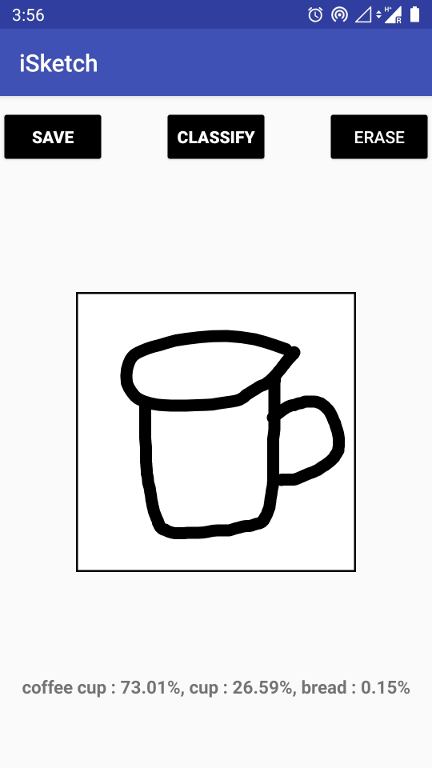

# iSketch

Android application for recognizing simple hand-drawn images.

## Prerequisites

Android Studio
Android Smartphone

## Features

* A paint canvas with draw & erase.
* Recognizes 100 different objects/shapes.
* Shows top three predictions.
* Provides voice output with tts.

## Screen shot

## Versioning

Version 1.0

## Authors

Anil Sathyan

## Acknowledgments
* "https://medium.com/tensorflow/train-on-google-colab-and-run-on-the-browser-a-case-study-8a45f9b1474e"
* "https://github.com/tensorflow/examples/tree/master/lite/examples/image_classification/android"
* "https://guides.codepath.com/android/Basic-Painting-with-Views"

